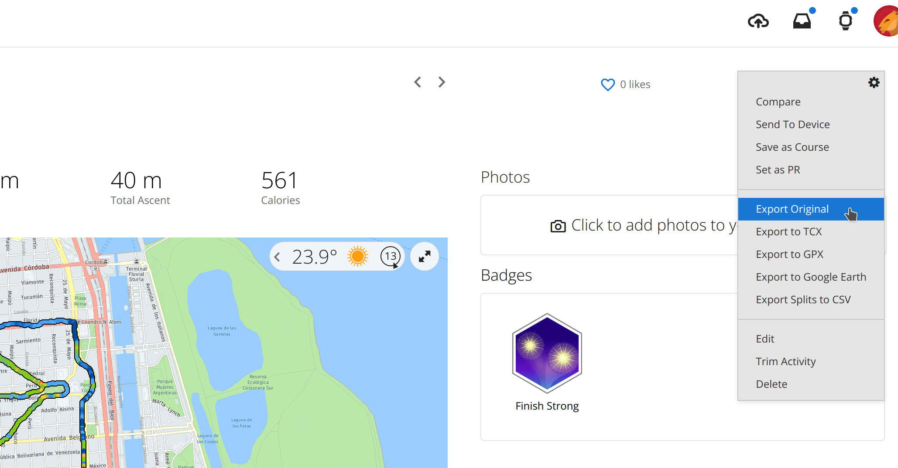

# VO2Max Tracker

Garmin (devices and connect app/website) does not show your VO2Max as a floating point number. Instead it shows it as an integer value, so it can be difficult to see what your device really measures in each training session.

This simple application tracks the VO2Max value that your device calculates in each training session. Be aware that the VO2Max showed by your device (or Garmin Connect) can differ from the one that was calculated. e.g. My running V02max is 52, but my watch was calculating values ranging from 51.20 to 51.64 for the last 6 weeks. 

## Features

- Chart of your VO2Max grouped by sport

  

- Support any sport where VO2Max is calculated (walking, running, cycling, etc)
- Activities 
  - Support for raw .fit files (activities stored in your device) 
  - Support for compressed fit files (.zip files) (activities exported from [Garmin Connect](https://connect.garmin.com/))
- Export your activities (only values defined in class FitData are exported)
  - Support for CVS files (easily read by Excel or any other spreedsheet)
  - Support for JSON files
- Cache of parsing results to improve execution speed  

## Requirements

- Python 3.9 or newer (it could be run on older versions, but it was not tested)
  - [Installation](https://www.python.org/getit/)
- Poetry Package Manager. 
  - [Installation](https://python-poetry.org/docs/#installation)

## Setup

1. Install Python and Poetry as noted in previous section
2. Download this project from [git](https://github.com/jalbiero/vo2max-tracker/archive/refs/heads/main.zip), decompress the .zip file wherever you want in your PC.
3. Connect your device, 
4. Copy the content of the device folder _activity_ (or _ACTIVITY_) into the project folder _activities_ (you can change this location see the file _vo2max_tracker/config.py_, look for the property ACTIVITY_DIR)
5. If you do not want to copy the activities from your device, you can download them from [Garmin Connect](https://connect.garmin.com/modern/) (one by one). Just select/view the activity you want to download, click on the upper right gear and select "Export Original". The zipped activity should be saved in the aforementioned _activity_ folder. It is not necessary to decompress the file.

    

6. Execute the application using the provided script for your platform (run_linux.sh, run_mac.sh, or run_win.ps1)

## Run

In order to run the application just execute one of the provided scripts via command line or file explorer. Be aware that the first run will take some time due to the following things:

1. It is necessary to download the runtime software dependencies
2. Decoding (parsing) a FIT file is slow (at least in Python) so dependending on the number of activities you will have to wait. Don't worry, the decoding results are cached so the next time the start up will be almost instant (unless you add new activities that need to be parsed). 

e.g. Run on Linux

```bash
$ ./run_linux.sh
```

## Export

### Export to CVS

```bash
$ ./run_linux.sh --csv --output my_activities.csv
```

### Export to JSON

```bash
$ ./run_linux.sh --json --output my_activities.json
```

## Help

For a full list of options just invoke its command line help

```bash
$ ./run_linux.sh --help

usage: app [-h] [-v] [-r] [-c] [-j] [-o OUTPUT]

optional arguments:
  -h, --help            show this help message and exit

General options:
  -v, --version         show VO2MaxReader version
  -r, --rcache          Recreate FIT cache. The application start-up will be very slow, be patience.

Export options:
  -c, --csv             Export all activities in CSV format
  -j, --json            Export all activities in JSON format
  -o OUTPUT, --output OUTPUT
                        Output file (when not specified, './export_output.txt' will be used
```

## Disclaimer

VO2Max Tracker was developed and tested on Linux (openSUSE 15.4) with data from Garmin FR-945 and FR-920. Older devices like the latter currently have partial support, so it is possible that no all information will be shown. VO2Max Tracker was also tested on Windows 10. I am sorry, but I do not have a Mac, so let me know if you have any issue on macOS.

## Troubleshooting

### Error when trying to execute .\run_win.ps1 on Windows

If you get the following error:

```powershell
PS C:\Users\Javier\vo2max_tracker> .\run_win.ps1
.\run_win.ps1 : File C:\Users\Javier\vo2max_tracker\run_win.ps1 cannot be loaded because running
scripts is disabled on this system. For more information, see about_Execution_Policies at
https:/go.microsoft.com/fwlink/?LinkID=135170.
At line:1 char:1
+ .\run_win.ps1
+ ~~~~~~~~~~~~~
    + CategoryInfo          : SecurityError: (:) [], PSSecurityException
    + FullyQualifiedErrorId : UnauthorizedAccess

```

Then you need to change the execution policy with the following PowerShell Cmdlet:

```powershell
PS C:\Users\Javier> Set-ExecutionPolicy -Scope "CurrentUser" -ExecutionPolicy "RemoteSigned" 

```

If anyone know how to change the execution policy just for _run_win.ps1_ script (instead of all scripts on the system), please let me know, thanks in advance.

## Other related tools

- [Runanalyze](https://runalyze.com)
- https://github.com/jimmykane/fit-parser 
- https://github.com/CraigMohn/fitparseR
- https://github.com/bleenhou/fitparser


## For developers

If you use [VSCode](https://code.visualstudio.com/) or [VSCodium](https://vscodium.com/) for development, you must use a virtual environment inside the project (e.g. vo2max-tracker/.venv directory) as noted in this [stack overflow answer](https://stackoverflow.com/a/64434542)

The following examples assume a terminal located in *vo2max-tracker* directory 

### Install full dependencies

```bash
$ poetry install
```

### Run application

```bash
$ poetry run app
```

### Run tests and code tools (isort, autopep and mypy)

```bash
$ poetry run tests
```

### Run tools without tests

```bash
$ poetry run tools
```
