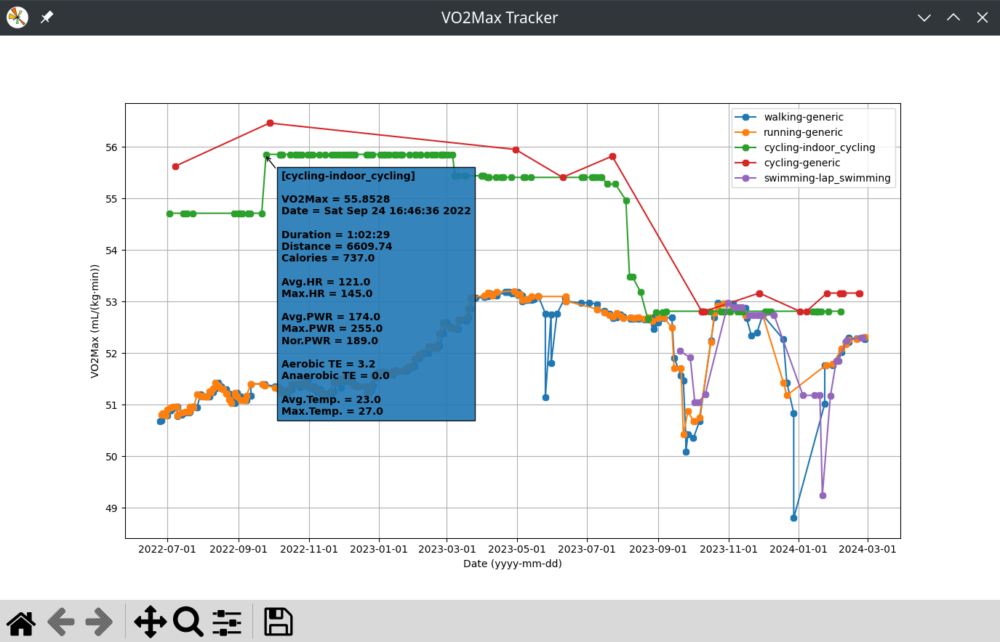

# VO2Max Tracker

Garmin (devices and connect app/website) does not show your VO2Max as a floating point number. Instead it shows it as an integer value, so it can be difficult to see what your device really measures in each training session.

This simple application tracks the VO2Max value that your device calculates in each training session. Be aware that the VO2Max showed by your device (or Garmin Connect) can differ from the one that was calculated. e.g. My running V02max was shown as 52, but my device was calculating values ranging from 51.20 and 51.55 for several weeks. 

## Features

- Chart of your VO2Max grouped by sport

  

- Support any sport where VO2Max is calculated (walking, running, cycling, etc)
- Activities 
  - Support for raw .fit files (activities stored in your device) 
  - Support for compressed fit files (.zip files) (activities exported from [Garmin Connect](https://connect.garmin.com/))
- Export your activities (only values defined in class FitData are exported)
  - Support for CVS files (easily read by Excel or any other spreedsheet)
  - Support for JSON files

## Requirements

- Python 3.9 or newer (it could be run on older versions, but it was not tested)
  - [Installation](https://www.python.org/getit/)
- Poetry Package Manager. 
  - [Installation](https://python-poetry.org/docs/#installation)

## Setup

1. Install Python and Poetry as noted in previous section
2. Download this project from [git](https://github.com/jalbiero/vo2max-tracker/archive/refs/heads/main.zip), decompress the .zip file wherever you want in your PC.
3. Connect your device, 
4. Copy the content of the device folder _activity_ (or _ACTIVITY_) into the project folder _activities_ 
5. If you don't want to copy the content, you can edit the file _vo2max_tracker/config.py_ in order to specify where the device folder is located through the property ACTIVITY_DIR)
6. Execute the application using the provided script for your platform (run_linux.sh, run_mac.sh, or run_win.ps1)

## Run, export

In order to run the app just execute one of the provided scripts. e.g. for Linux

```
$ ./run_linux.sh
```

Export to CVS

```
$ ./run_linux.sh --csv --output my_activities.csv
```

Export to JSON

```
$ ./run_linux.sh --json --output my_activities.json
```

For a full list of options invoke its command line help

```
$ ./run_linux.sh --help

usage: app [-h] [-v] [-r] [-c] [-j] [-o OUTPUT]

optional arguments:
  -h, --help            show this help message and exit

General options:
  -v, --version         show VO2MaxReader version
  -r, --rcache          Recreate FIT cache. The application start-up will be very slow, be patience.

Export options:
  -c, --csv             Export all activities in CSV format
  -j, --json            Export all activities in JSON format
  -o OUTPUT, --output OUTPUT
                        Output file (when not specified, './export_output.txt' will be used
```

## Other related tools

- [Runanalyze](https://runalyze.com)
- https://github.com/jimmykane/fit-parser 
- https://github.com/CraigMohn/fitparseR
- https://github.com/bleenhou/fitparser


## For developers

The following assumes a terminal located in *vo2max_tracker* directory 

### Install full dependencies

```
$ poetry install
```

### Run application

```
$ poetry run app
```

### Run tests and code tools (isort, autopep and mypy)

```
$ poetry run tests
```

### Run tools without tests

```
$ poetry run tools
```
